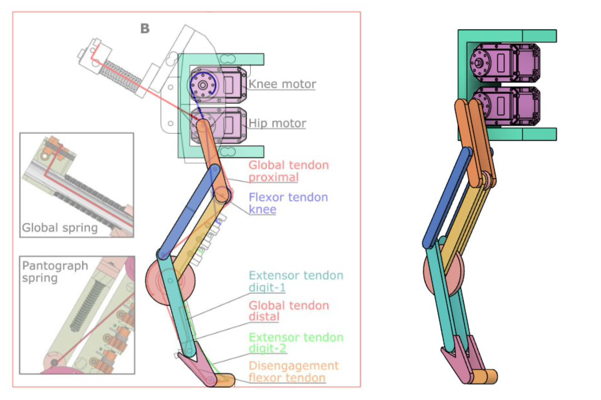
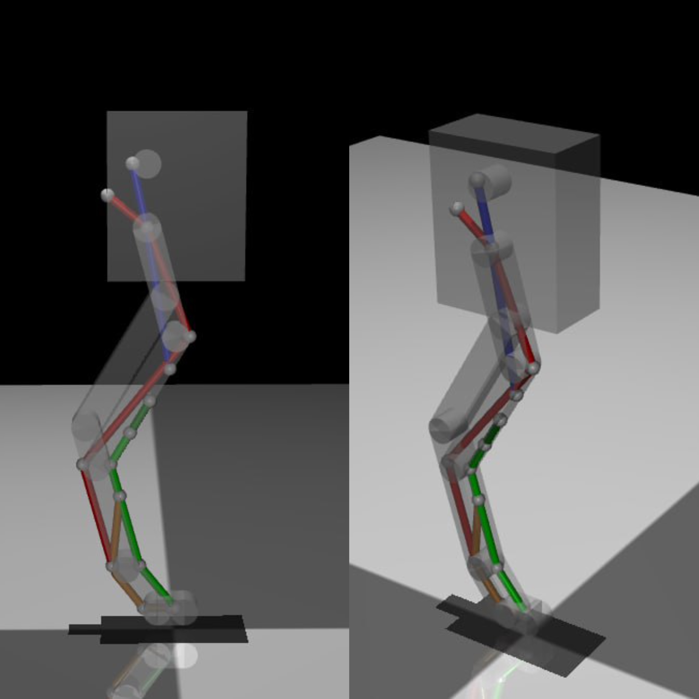
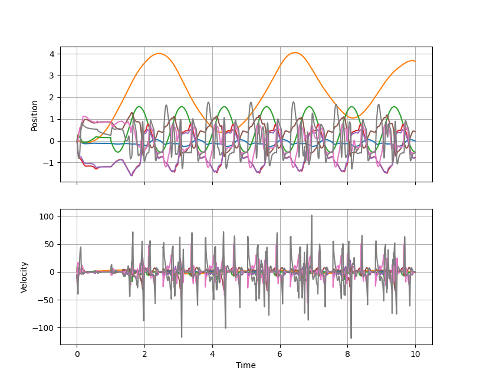
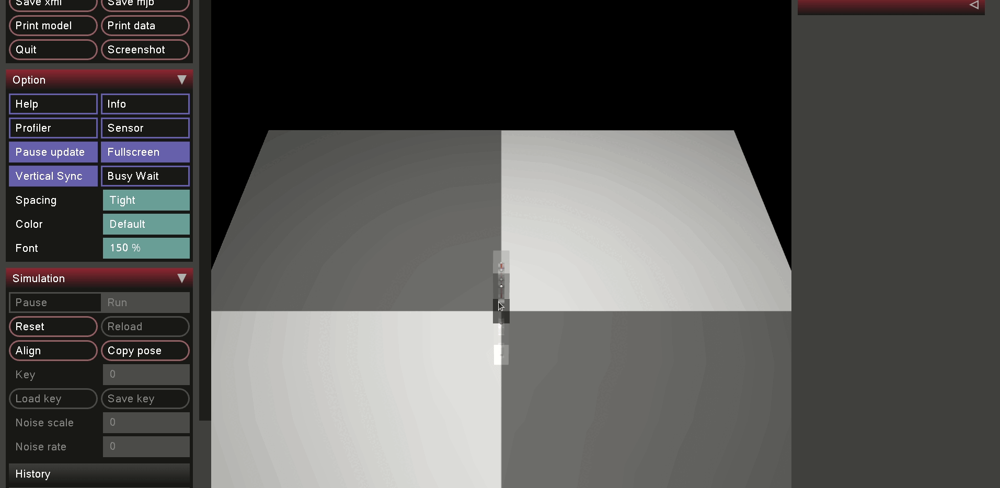

# BirdBor MuJoCo
## Общая информация
Все скрипты написаны с использованием интерпретатора `Python 3.8.10` с использованием виртуального окружения из папки `venv`. Для активации виртуального окружения пропишите в терминале команду:
```
source venv/bin/activate
```
После окончания работы окружение можно отключить с помощью команды `deactivate`

В папке `xml_examples` собраны примеры различных динамических моделей MuJoCo, часть .xml-кода было позаимствовано из данных примеров. 

## Скрипт `BirdBot_xml_generator.py`
В скрипте автоматически создается .xml файл для модели BirdBot. В качестве референса была взята иллюстрация из статьи [BirdBot achieves energy-efficient gait with minimal control using avian-inspired leg clutching](./BirdBot_paper.pdf).



Модель была отрисована во `Fusion360`, размеры модели были откалиброваны относительно мотора **Dynamixel MX-64AT**, который использовали авторы статьи. Модель доступна в [облаке Fusion360](https://a360.co/47Tu9Hj)

Скрипт `BirdBot_xml_generator.py` реализован через шаблон f-строки. В целом, реализация может варьироваться от сложности, например для автоматизации можно использовать древовидные структуры в python и собирать xml-строки через рекурсивные алгоритмы. Но подобной задачи не стояло, поэтому сам скрипт представляет собой параметризованную сборку стандартных моделей в модель робота. В переменных `LINK_i`, где `i` - номер сочленения по [CAD-модели](https://a360.co/47Tu9Hj), зашита информация об имени тела, имени вращательного сустава, начальных координатах `y0` и `z0`, длине сочленения `length` и его начальном повороте вокруг оси `X` в системе отсчета, связанной с землей. В переменной `LINK_SIZE` находится значение ширины сочленений. Переменная `FLOOR_POSITION` отвечает за положение пола относительно нуля модели. В переменной `K` содержится значение жесткости троссов, соединяющих элементы конструкции. В переменной `ELECTRONICS_BOX` содержатся линейные размеры блока электроники модели.

Сама модель построена по принципу "сверху-вниз". Базовым элементом является блок электроники, его начальное положение берется за нулевую точку системы координат, связанной с землей. Блок электроники соеденен с внешним миром через линейный сустав, поскольку модель не является симметричной и возможно вектор силы тяжести блока выходит за площадь косания ноги с землей. Далее от блока электроники отходят сочленения, составляющие ногу робота. Для поддержания структуры замкнутой цепочки между элементами `link_1`, `link_2`, `link_3` и `link_4` введено ограничение на кинематику модели - конец элемента `link_2` должен прилегать к элементу `link_4` в `join_4`. Упругие троссы проложены в соответствии с иллюстрацией выше.



В процессе исполнения генерируется .xml-файл, сохраняется в файл `BirdBot.xml` и отрисовывается нулевое положение робота без учета динамики.

Запустить модель во встроенном симуляторе Mujoco можно с помощью команды:
```
python -m mujoco.viewer --mjcf=BirdBot.xml 
```

## Скрипт `BirdBot_jump_trial.py`
В скрипте используется встроенный симулятор `mujoco-viewer`, в частности его пассивная версия, для управления моделью через python-скрипты. В скрипте время симуляции приведено к физическому времени на исполняющем компьютере, соответственно временные промежутки соответствуют общепринятым секундам. Для прыжка использовалось управление по позиции в бедренном суставе робота. Модель управления состоит из гармонической функции со сдвигом. Полученные графики и симуляцию можно увидеть ниже:





## Дальнейшее развитие модели
На данном этапе стоит переработать передачу от мотора в электронном блоке к коленному суставу, поскольку на текущий момент эта передача не работает, а угол в суставе испытывает сингулярность (значение угла бесконечно растет без внешних вынуждающих сил). Дополнительно необходимо проработать модель с точки зрения коллизий, развести элементы моделей в пространстве чтобы минимизировать их точки контакта и уменьшить погрешности встроенных компиляторов для симуляций.

В будущем стоит доделать модель до двуногой версии и проработать алгоритм CPG для генерации паттерна походки. При этом паттерн для каждой ноги должен отличаться на одну фазу движения. В дальнейшем стоит переводить связь между "миром" и блоком электроники из линейного сустава в свободный сустав для проверки устойчивости модели. Также в модели дополнительно можно задавать массы, тензоры инерции, коэффициенты трения и тд, для наиболее точной симуляции.